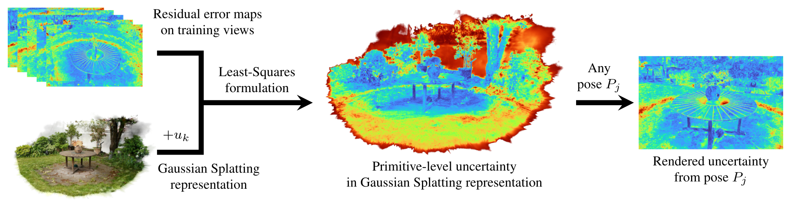

# Predictive Photometric Uncertainty in Gaussian Splatting for Novel View Synthesis
*Chamuditha Jayanga Galappaththige, Thomas Gottwald, Peter Stehr, Edgar Heinert, Niko Suenderhauf, Dimity Miller, Matthias Rottmann*

| [Project Page](https://chumsy0725.github.io/3DGS-Uncertainty/) | [Paper](https://arxiv.org/abs/2603.22786) |

## Overview


*Abstract:* Recent advances in 3D Gaussian Splatting have enabled impressive photorealistic novel view synthesis. However, to transition from a pure rendering engine to a reliable spatial map for autonomous agents and safety-critical applications, knowing where the representation is uncertain is as important as the rendering fidelity itself. We bridge this critical gap by introducing a lightweight, plug-and-play framework for pixel-wise, view-dependent predictive uncertainty estimation. Our post-hoc method formulates uncertainty as a Bayesian-regularized linear least-squares optimization over reconstruction residuals. This architecture-agnostic approach extracts a per-primitive uncertainty channel without modifying the underlying scene representation or degrading baseline visual fidelity. Crucially, we demonstrate that providing this actionable reliability signal successfully translates 3D Gaussian splatting into a trustworthy spatial map, further improving state-of-the-art performance across three critical downstream perception tasks: active view selection, pose-agnostic scene change detection, and pose-agnostic anomaly detection. 

## Setup

Cloning the repository:
```sh
git cone https://github.com/Chumsy0725/3DGS-U.git --recursive
```

Setting up the python environment:
```sh
conda create -n 3dgs_u python=3.9
conda activate 3dgs_u

# torch
pip install torch==2.4.0 torchvision==0.19.0 torchaudio==2.4.0 --index-url https://download.pytorch.org/whl/cu124

# requirements
pip install matplotlib opencv-python plyfile scipy tqdm

# submodules
# diff-gaussian-rasterization
pip install submodules/diff-gaussian-rasterization --no-build-isolation
# simple-knn
pip install submodules/simple-knn --no-build-isolation
# (optional) fused-ssim
pip install submodules/fused-ssim --no-build-isolation
```

Get datasets to reproduce results:
```sh
mkdir data
cd data

# mipnerf360
mkdir mipnerf360
cd mipnerf360
wget http://storage.googleapis.com/gresearch/refraw360/360_v2.zip
wget https://storage.googleapis.com/gresearch/refraw360/360_extra_scenes.zip
unzip 360_v2.zip
unzip 360_extra_scenes.zip

# tanks&temples (train, truck) and deep blending (drjohnson, playroom)
cd ..
wget https://repo-sam.inria.fr/fungraph/3d-gaussian-splatting/datasets/input/tandt_db.zip
unzip tandt_db.zip
```

## General Usage

### 1. Train Gaussian Splatting
```sh
python train.py \
--source_path <input_path> \
--model_path <scene_path> \
--iterations 30000 \
--eval
```
<details>
<summary><span style="font-weight: bold;">Important parameters</span></summary>
* `-s`, `--source_path`
  Path to the source images of the scene.

* `-i`, `--images`
  Folder containing the source images (default='images').

* `-m`, `--model_path`
  Path where the Gaussian Splatting model will be stored.

* `--iterations`
  Number of training iterations.

* `--resolution`
  Downscaling factor for the input image resolution.

* `--eval`
  Holds out a subset of images for evaluation.

* `--sparseTrainingViews` 
  Sparse training view setting. Limit to 4 distributed views for training.
</details>


### 2. Fit Uncertainty Channel
```sh
python train_errors.py \
--source_path <input_path> \
--model_path <scene_path> \
--iterations 3000 \
--error_sh_degree 3 \
--eval
```
<details>
<summary><span style="font-weight: bold;">Important parameters</span></summary>
General Gaussian Splatting parameters are identical to those of the standard training script.

* `--error_sh_degree`
  Spherical Harmonics degree of uncertainty channel.

* `--lambda_reg`
  Hyperparameter for Bayesian regularization (default: 0; the default for dense captures).

* `--uncertain_background`
  Treat the background as high-uncertainty when rendering final outputs.
</details>


## Reproduce Results from Paper
We provide some scripts to easily reproduce the main results of our work.

Main uncertainty quantification results:
```sh
DATASET_BASE_PATH=data OUTPUT_BASE_PATH=output bash run_dense.sh
```

Sparse view study with Bayesian regularization:
```sh
DATASET_BASE_PATH=data OUTPUT_BASE_PATH=output_sparse bash run_sparse.sh
```

## Acknowledgement

Our code is based on [3D Gaussian Splatting](https://github.com/graphdeco-inria/gaussian-splatting).

## Funding Acknowledgement
This work was supported by the Australian Research Council Research Hub in
Intelligent Robotic Systems for Real-Time Asset Management (IH210100030)
(ARIAM) and Abyss Solutions. C.J., N.S., and D.M. also acknowledge ongoing
support from the QUT Centre for Robotics. T.G. P.S., and M.R. acknowledge
support by the state of North Rhine-Westphalia and the European Union within
the EFRE/JTF project “Just scan it 3D”, grant no. EFRE-20800529. E.H. and
M.R. acknowledge support through the junior research group project “UnrEAL”
by the German Federal Ministry of Education and Research (BMBF), grant no.
01IS22069. M.R. also acknowledges mobility support by the German Academic
Exchange Service (DAAD PPP), grant no. 57700453.